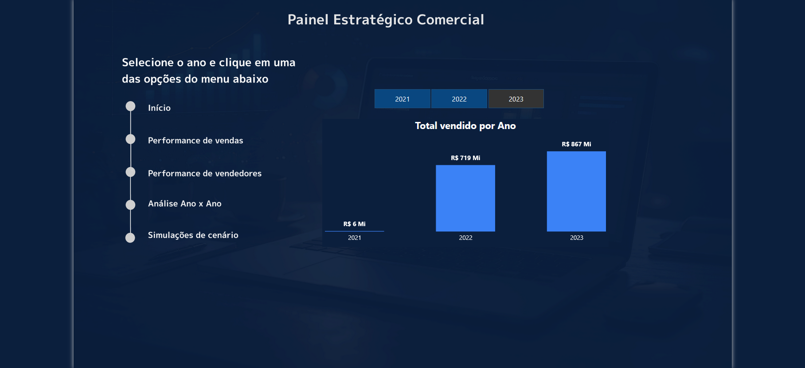
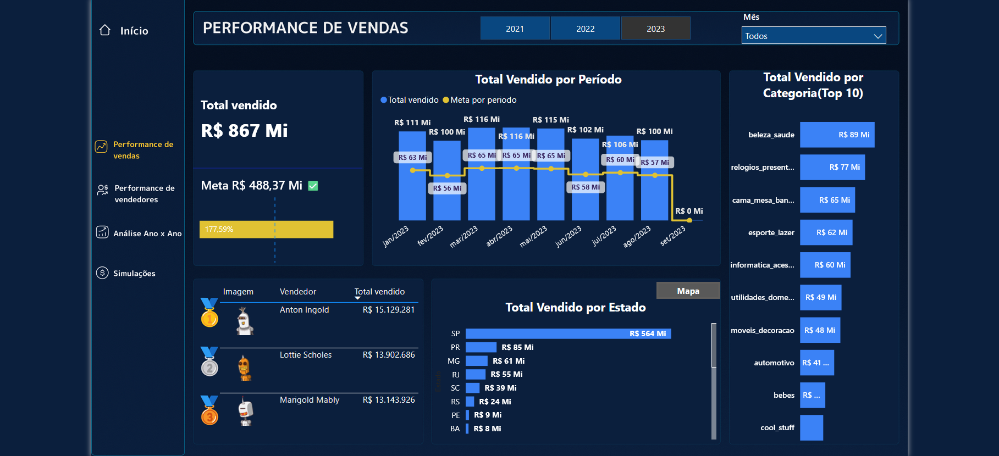
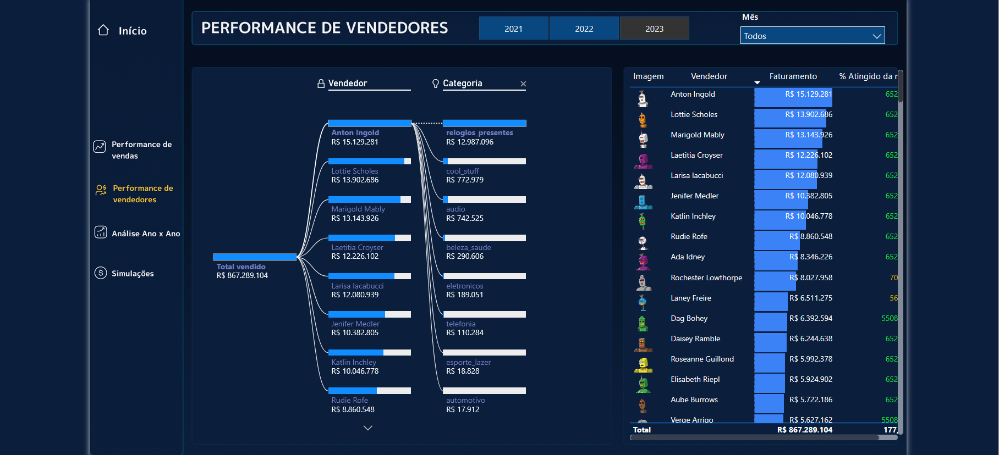
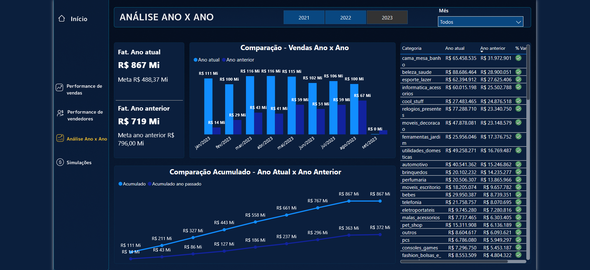
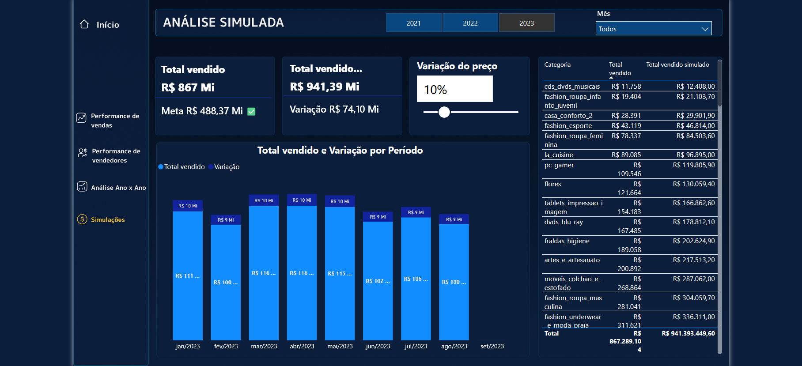
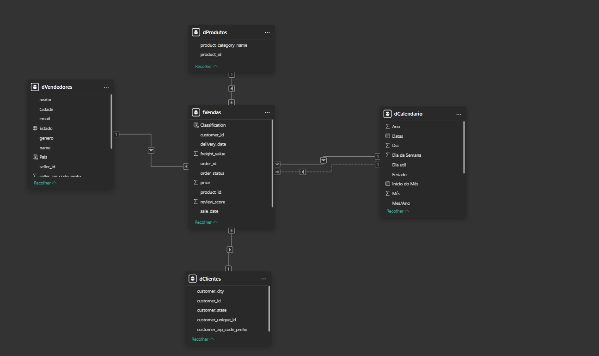
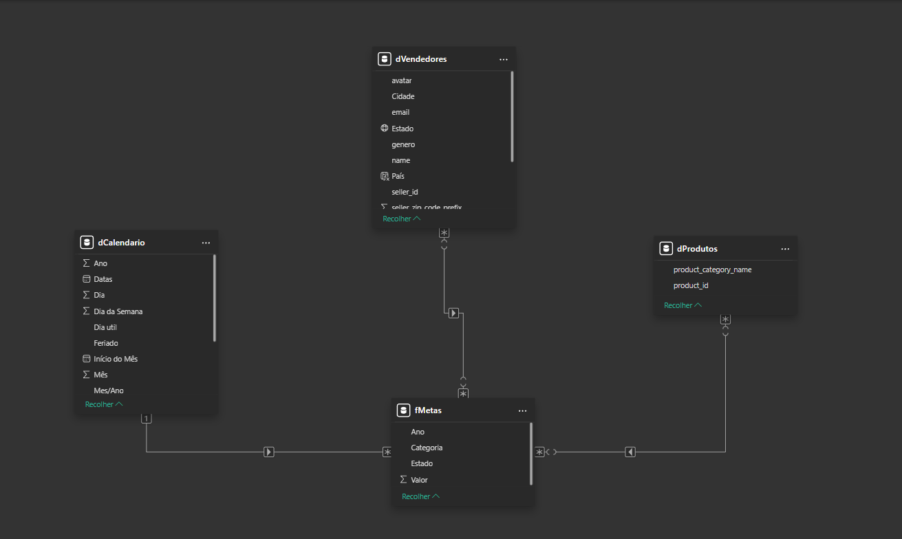

# Painel Estratégico Comercial — Power BI 📊

Dashboard comercial desenvolvido para dar ao gestor uma visão completa da operação de negócio: do acompanhamento vendas e metas até a simulação de impacto de decisões de preço. O painel cobre dados de 2021 a 2023 e foi estruturado para análises operacionais e decisões estratégicas.

---

## 🖥️ - Informações do projeto - Páginas do Dashboard

### Início

 - Tela de navegação com menu lateral e visão macro do total vendido por ano. Serve como ponto de entrada com seletor de ano e acesso direto às demais páginas.

---

### Performance de Vendas

* Visão consolidada do faturamento com acompanhamento da meta no período analisado. Em 2023, o total vendido chegou a R$ 867 Mi contra uma meta de R$ 488 Mi — 177% de atingimento. 

* O painel deixa claro em quais meses o ritmo ficou acima da linha de meta e onde houve queda, com ranking visual dos top vendedores e distribuição geográfica por estado. Quando 90% da meta é atingido, já é gerado um indicador(✅) positivo

* Aparentemente há um mau dimensionamento da meta nesse ano de 2023, já que no próprio gráfico é possível perceber que todos os meses ultrapassaram a meta com folga.

**A alternância entre **mapa e gráfico de barras** foi implementada com Indicadores + Botões, sem necessidade de página adicional.**

---

### Performance de Vendedores

 Detalhamento individual da equipe de vendedores com uma análise por categoria utilizando a árvore hierárquica. É possível ver não só quanto cada vendedor faturou, mas em quais categorias ele concentra sua performance, que é útil para identificar se um vendedor é forte em várias frentes ou depende de uma categoria específica para sustentar seus números. 

 A matriz com os vendedores e seus respectivos faturamentos também conta com uma **tooltip** interativa. Basta passar o mouse em cima de cada vendedor que é possível observar quanto ele vendeu, o valor de sua meta e um gráfico de indicador que mostra se o vendedor conseguiu ter uma boa perfomance no atingimento da meta.

- **Nota sobre o % Atingido da Meta:** Alguns vendedores apresentam percentuais muito acima do esperado. A base de metas utilizada é pública e pré-formatada por estado/categoria, sem metas individuais por vendedor. A medida distribui a meta do estado proporcionalmente à participação de cada vendedor no total da empresa — o que, combinado com inconsistências nos valores da base de 2023 (metas de estados-chave como SP e RJ desproporcionalmente baixas), produz distorções no indicador. Em um ambiente produtivo, esse ponto seria endereçado com metas individuais cadastradas ou uma distribuição baseada no total de vendas do estado.

---

### Análise Ano x Ano

* Comparativo direto entre o ano atual e o anterior, mês a mês e acumulado. O salto de R$ 719 Mi (2022) para R$ 867 Mi (2023) representa crescimento de aproximadamente 20,6%. A curva acumulada dos dois anos lado a lado deixa evidente se o crescimento foi consistente ao longo do ano ou concentrado em poucos meses. Todas as categorias aparecem com variação percentual, facilitando a identificação de onde o crescimento veio de fato e onde houve retração.
* Os acumulados foram calculados considerando o mesmo período de tempo, como o ano de 2023 só apresentou vendas ate o mês de agosto, o acumulado do ano anterior(2022) também só considera vendas até esse mesmo período, facilitando a análise comparativa de ano x ano.

---

### Simulação de Cenário

O gestor consegue simular o impacto de um aumento de preço na receita total antes de tomar qualquer decisão. Com um slider, ele ajusta a variação percentual e vê instantaneamente o novo faturamento projetado, a diferença em R$ e obtém uma análise também por categoria. Com 10% de aumento, por exemplo, a receita simulada passaria de R$ 867 Mi para R$ 941 Mi — uma variação de R$ 74 Mi.

A medida `Total vendido simulado` utiliza de um parâmetro dinâmico desconectado da tabela fato. O dado original permanece intacto; o cenário é calculado inteiramente como uma forma de inteligência analítica, grantindo que  nenhuma simulação venha a afetar os números reais do modelo.

---

## Modelagem

 

O modelo segue arquitetura **Star Schema** com duas tabelas fato e quatro dimensões:

- `fVendas` — Dados de todas as vendas
- `fMetas` — Metas por ano, categoria e estado
- `dCalendario` — Tabela de datas com dias úteis e feriados, criada totalmente pela linguagem M
- `dProdutos` — Categorias dos produto
- `dVendedores` — Dados dos vendedores
- `dClientes` — Dados dos clientes

---

## Medidas DAX

As medidas foram organizadas em **pastas** por categoria, seguindo boas práticas de governança do modelo:

**Inteligência de Tempo** — `TOTALYTD`, `SAMEPERIODLASTYEAR`, `DATESBETWEEN` para comparações de período que se comportam corretamente com qualquer filtro de data aplicado pelo usuário.

**Percentuais** — `% Atingido da Meta`, `% Variação YoY`, participação por localidade e por vendedor, média mensal e KPIs de formatação condicional.

**Totais** — faturamento base, meta por período, simulação de cenário, acumulado móvel, média móvel, ranking de vendedores e contagem de pedidos.

A medida de meta por período calcula dinamicamente o percentual de participação de cada vendedor no total do ano e aplica esse percentual sobre a meta anual do estado, distribuindo a meta ao longo dos meses proporcionalmente ao ritmo real de vendas.

👉 ![Clique aqui para baixar o arquivo .pbix do dashboard](

---

## 🛠️ Ferramentas utilizadas 

- Power Query para importação e tratamento das tabelas
- Tabela calendário feita totalmente na linguagem M
- Star Schema com duas tabelas fato relacionadas às mesmas dimensões
- DAX com `TOTALYTD`, `SAMEPERIODLASTYEAR`, `DATESBETWEEN`, `RANKX`, `CALCULATE` com modificadores de filtro
- Parâmetros para simulação dinâmica de cenário de preço
- Indicadores + Botões para alternância entre mapa e gráfico de barras na página de vendas, que detalha o total vendido por estado
- Árvore Hierárquica para análise clara e coesa de vendas por vendedor e categoria
- Formatação condicional para destaque visual de performance vs. meta
- Pastas para organização e governança das medidas

---

🛠️ Power BI · DAX · Power Query · Star Schema · What-If Analysis
